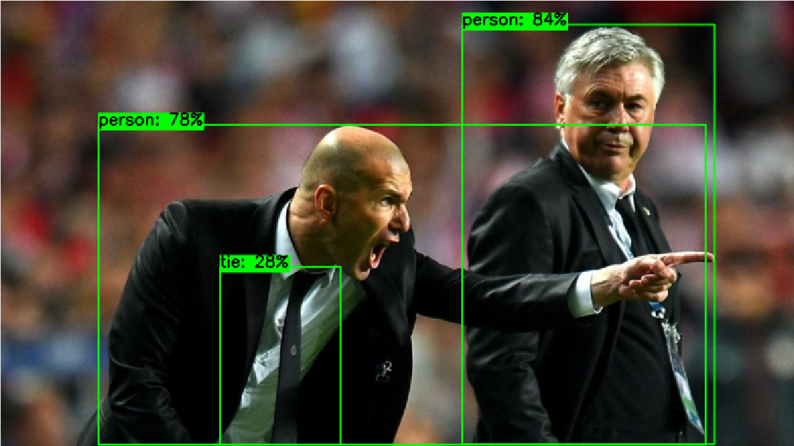

# Qt OpenCV DNN目标检测示例项目

这是一个使用Qt和OpenCV DNN模块实现目标检测的示例项目。本项目展示了如何在Qt应用程序中集成OpenCV的深度学习功能，实现了一个简单的目标检测应用程序。

## 功能特点

- 支持动态选择ONNX模型文件
- 支持选择任意图片进行检测
- 实时显示检测结果
- 支持YOLO系列模型
- 自动标注目标位置和类别信息

## 环境配置

### 必需组件

1. **Qt开发环境**
   - Qt 5.15或更高版本
   - Qt Creator或Visual Studio（带Qt插件）
   - CMake 3.15或更高版本

2. **OpenCV库**
   - OpenCV 4.5.0或更高版本
   - 必须包含opencv_dnn模块

3. **编译器要求**
   - Windows: MSVC 2019或更高版本
   - Linux: GCC 7.0或更高版本

### 安装步骤

1. **安装Qt**
   - 从Qt官网下载Qt在线安装器
   - 安装Qt开发环境（确保安装相应的编译器）

2. **安装OpenCV**
   - Windows:
     ```
     下载OpenCV预编译包或从源码编译
     设置系统环境变量OPENCV_DIR指向OpenCV安装目录
     将%OPENCV_DIR%\bin添加到PATH环境变量
     ```
   - Linux:
     ```bash
     sudo apt update
     sudo apt install libopencv-dev
     ```

3. **验证安装**
   - 确保能在命令行中运行：
     ```bash
     cmake --version
     ```
   - 检查OpenCV是否正确安装：
     ```cpp
     #include <opencv2/opencv.hpp>
     ```

## 项目结构

```
.
├── CMakeLists.txt          # CMake配置文件
├── main.cpp                # 程序入口
├── mainwindow.h            # 主窗口头文件
├── mainwindow.cpp          # 主窗口实现
└── README.md              # 项目说明文档
```

## 代码说明

### 主要类说明

1. **MainWindow** - 主窗口类
   - 管理UI界面
   - 处理文件选择
   - 执行目标检测
   - 显示检测结果

### 关键功能实现

1. **模型加载**
```cpp
cv::dnn::Net net = cv::dnn::readNetFromONNX(modelPath.toStdString());
```

2. **图像预处理**
```cpp
cv::Mat blob;
cv::dnn::blobFromImage(frame, blob, 1/255.0, cv::Size(640, 640), 
                       cv::Scalar(), true, false);
```

3. **目标检测**
```cpp
net.setInput(blob);
std::vector<cv::Mat> outputs;
net.forward(outputs, net.getUnconnectedOutLayersNames());
```

### CMake配置

项目的CMakeLists.txt关键部分：

```cmake
find_package(OpenCV REQUIRED)
find_package(Qt5 COMPONENTS Widgets REQUIRED)

add_executable(${PROJECT_NAME}
    main.cpp
    mainwindow.cpp
    mainwindow.h
)

target_link_libraries(${PROJECT_NAME} 
    Qt5::Widgets
    ${OpenCV_LIBS}
)
```

## 使用说明

1. **编译项目**
   ```bash
   mkdir build
   cd build
   cmake ..
   cmake --build .
   ```

2. **运行程序**
   - 点击"选择模型"按钮选择ONNX模型文件
   - 点击"选择图片"按钮选择要检测的图片
   - 程序会自动执行检测并显示结果

3. **支持的模型**
   - YOLO系列模型（v5、v8等）
   - 其他支持ONNX格式的目标检测模型

## 注意事项

1. **模型兼容性**
   - 确保使用正确格式的ONNX模型
   - 模型的输入尺寸应为640x640
   - 输出应符合YOLO格式要求

2. **性能优化**
   - 默认使用CPU推理，可修改代码启用GPU加速
   - 根据实际需求调整置信度阈值和NMS阈值

3. **常见问题**
   - 如果无法加载模型，检查文件路径和格式
   - 如果检测结果不准确，可能需要调整模型参数
   - 确保OpenCV编译时包含了DNN模块

## 演示效果

### 原始图片

这是输入到系统中的原始测试图片，图中展示了一位足球运动员的场景。

### 检测结果

使用YOLO模型检测后的结果。可以看到系统成功识别出了图中的人物，并用边界框（bounding box）标注出目标位置，同时显示了对应的类别标签和置信度得分。

## 扩展开发

1. **添加新功能**
   - 支持视频流检测
   - 添加批量检测功能
   - 支持保存检测结果

2. **优化建议**
   - 添加进度条显示
   - 实现多线程处理
   - 添加更多模型格式支持

## 许可证

本项目采用MIT许可证，详细信息请参见LICENSE文件。

## 贡献指南

欢迎提交Issue和Pull Request来改进这个示例项目。

## 参考资源

- [OpenCV官方文档](https://docs.opencv.org/)
- [Qt官方文档](https://doc.qt.io/)
- [YOLO项目](https://github.com/ultralytics/yolov5)
